# AOPPO classes

## Description

Домашние задания по предмету Основы алгоритмизации и проектирования программного обеспечения

### Technologies

* Java 21
* Maven

## Download project files

Скачайте файлы проекта через терминал

```
git clone https://github.com/Ivanmc-007/com.ivan.ppois.2609.oappo
```

## Installation

### Run in Intellij IDEA

1. Откройте папку с проектом в Intellij IDEA
2. Найдите файл **pom.xml** и кликните по нему правой клавишей мыши. В открывшемся меню выберите пункт **Add as Maven
   Project**

## Additional info

### Note

Выполненное практическое задание 1 описано ниже.

Выполненные практические задания со 2 по 10 находятся в папке по пути src/**main**/java/com/ivan/ppois.

Автоматическая проверка (тесты) написанного функционала находится в папке по пути src/**test**/java/com/ivan/ppois.

### Запуск тестов через терминал
```
mvm clean test
```

### Задание 1. Блок-схемы алгоритмов







